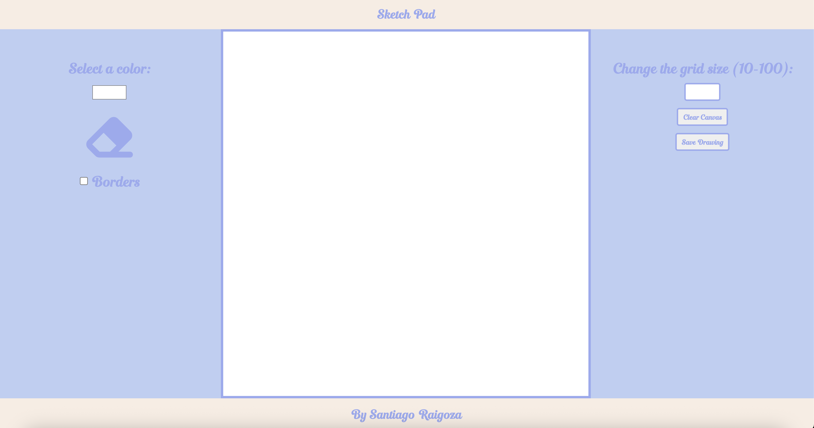

# Sketch Pad

A simple and interactive browser-based sketch pad built with HTML, CSS, and JavaScript. Customize grid size, choose colors, toggle borders, erase, and even download your artwork as an image.

## Features

- Click-and-drag to draw on a dynamic grid  
- Select any color using the color picker  
- Adjust grid size (e.g., 10x10, 20x20, etc.)  
- Eraser tool to remove individual squares  
- Toggle grid borders on or off  
- Clear the entire sketch pad  
- Download your sketch as a PNG image  

## Screenshot


## Technologies Used

- HTML  
- CSS  
- JavaScript (Vanilla)  

## 🚀 How to Run Locally
1. Clone the repository:
2. Navigate to the project directory
3. Open index.html in your browser or visit the live version of the game by clicking the link in the About section

## Project Structure
```
Sketchpad/
├── fonts
├── images
├── index.html
├── style.css
├── javascript.js
└── README.md
```

## Author
Created by Santiago Raigoza